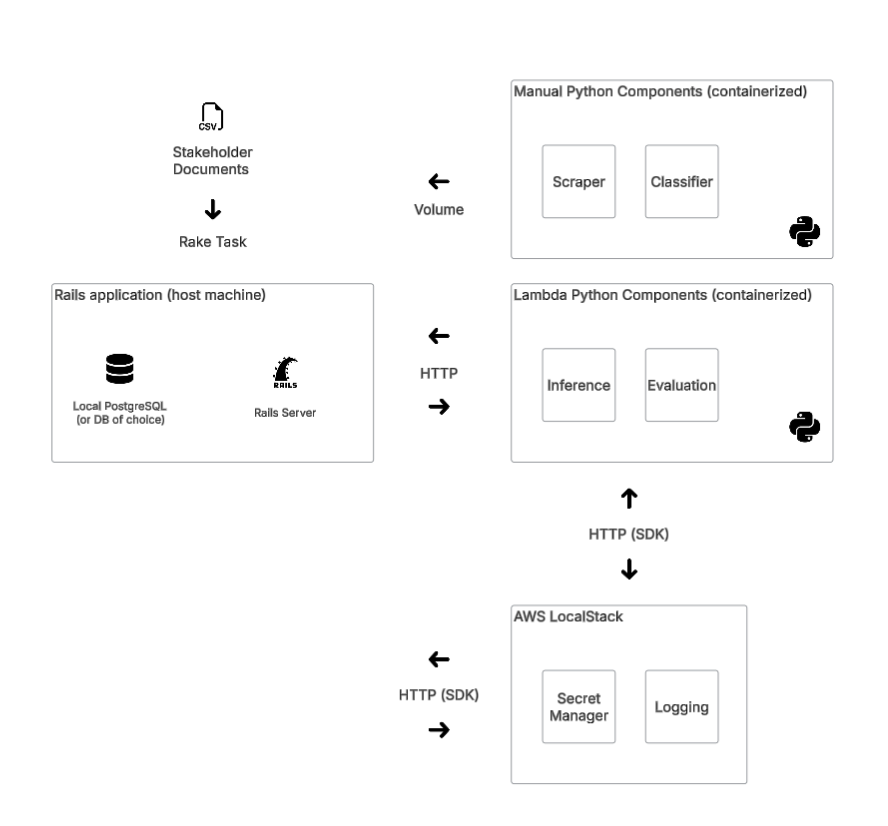
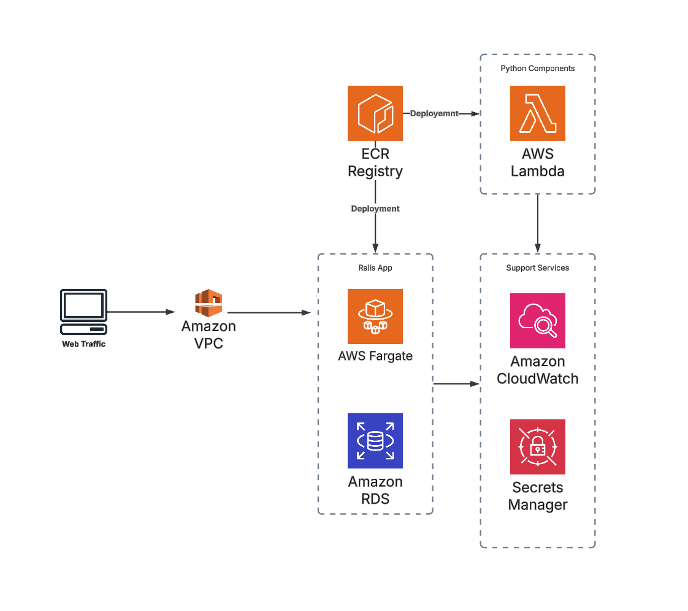
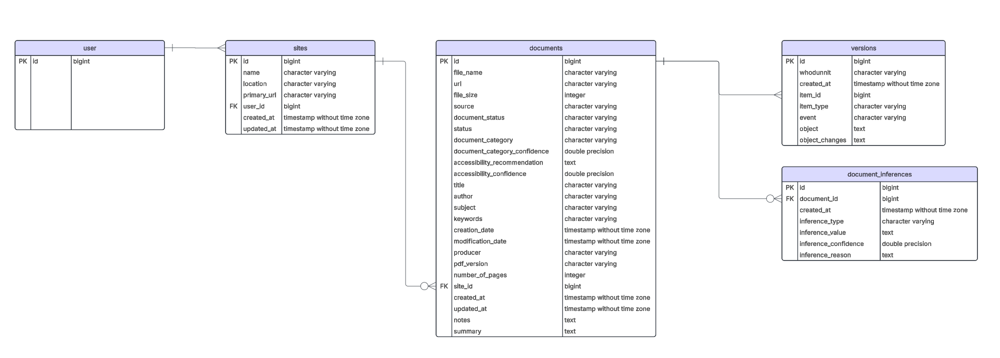

# Architecture

## Local Development

Current ASAP application architecture prioritizes rapid development while maintaining high parity between production and local development environments. A Rails application provides the user interface and API integration for Python components, which perform AI tasks.

Two of our Python components are run locally by staff, which result in CSV output. The CSV output is then consumed via Rake tasks to create site and document records.

User management is currently manual.

## Production

Our production infrastructure leverages Amazon Web Service (AWS). While it may be possible to run the app with Google Cloud or Azure backing, only AWS has been tested.
The AWS production environment is maintained via OpenTofu configuration as code. See the [terraform](../terraform) directory for details. Below is a simplified application diagram representing high level AWS utilization.

## Rails Database

Below is a document-centric entity relationship diagram of the Rails APP's database. Documents belong to sites, which belong to users. Access is currently enforced at the site level. The document_inferences table stores results from LLM inquiries for each document. Versioning is provided by the [PaperTrail](https://github.com/paper-trail-gem/paper_trail) gem on the document table only.

